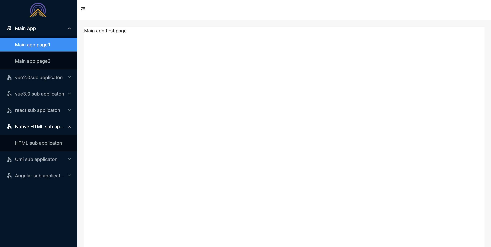
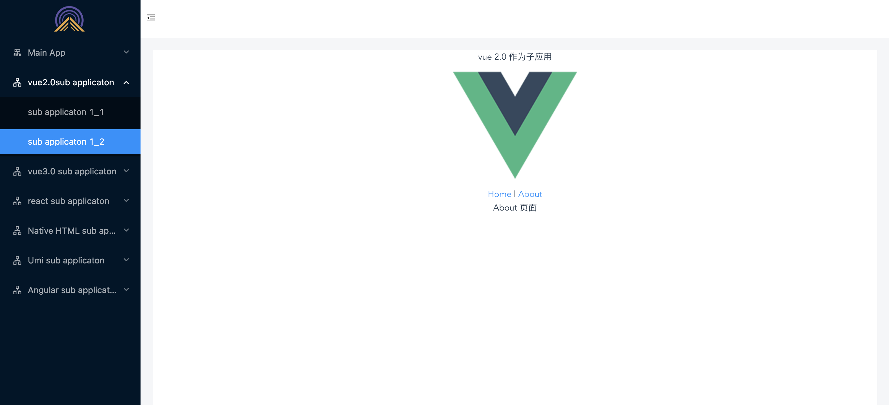
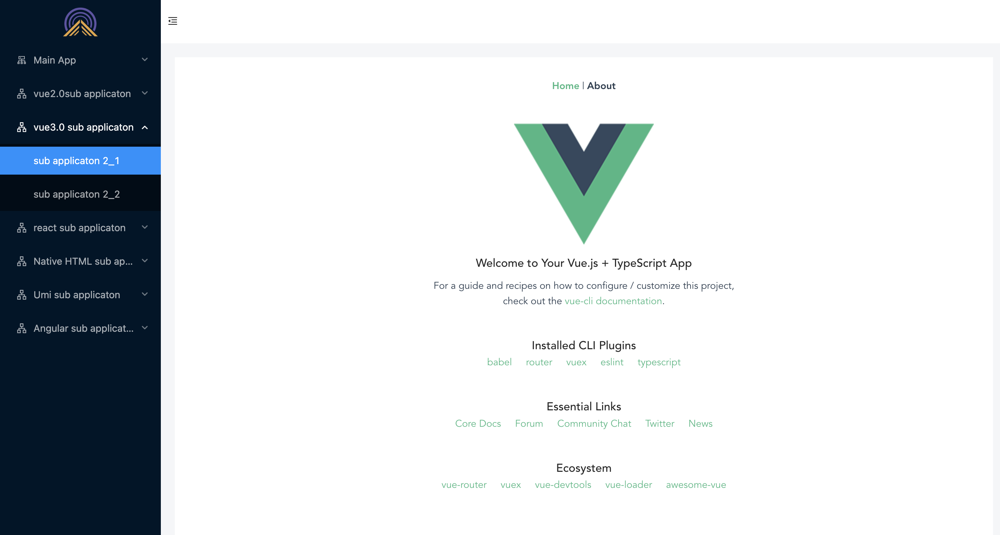
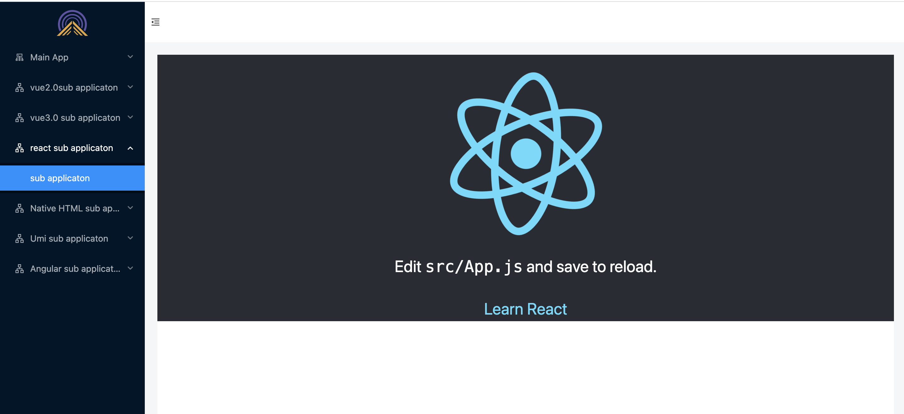
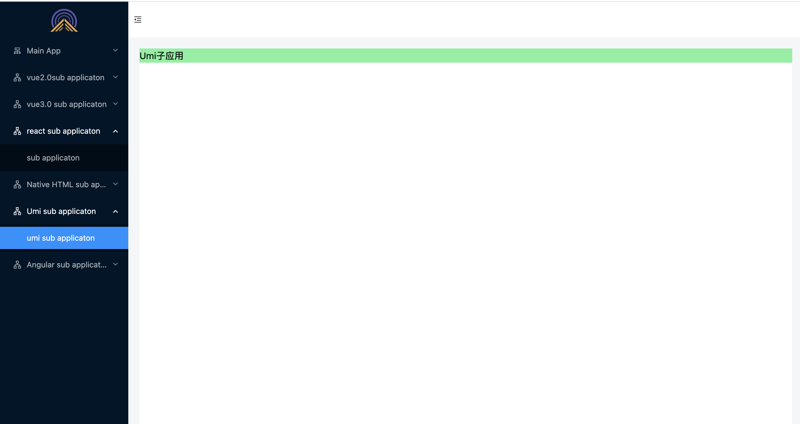
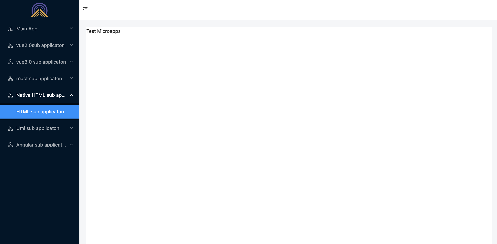
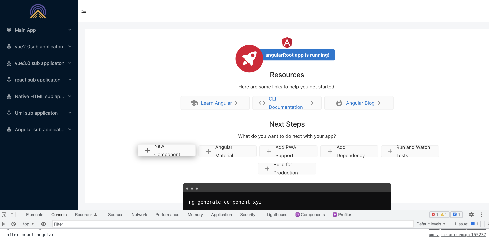

# Qiankun

## Introduction - What is qiankun?

Qiankun is one of an implementation of Micro Frontends, which based on [single-spa](https://github.com/CanopyTax/single-spa). It aims to make it easier and painless to build a production-ready micro frontend architecture system.

Qiankun hatched from Ant Financial’s unified frontend platform for cloud products based on micro frontends architecture. After full testing and polishing of a number of online applications, Ant f2e team extracted its micro frontend kernel and open sourced it. The f2e team hope to help the systems who has the same requirement more convenient to build its own micro frontends application in the community. At the same time, with the help of community, qiankun will be polished and improved.

At present, qiankun has served more than 200 online applications inside Ant, and it's definitely trustworthy in terms of ease of use and completeness.

## What is Micro FrontEnd?

It's a techniques, strategies and recipes for building a modern web app with multiple teams that can ship features independently.

The current popular micro-frontend solutions include the following:：

- iframe
- The pedestal mode, mainly based on route distribution, qiankun and single-spa are based on this mode
- Npm packages, That is, build components separately and load them on demand
- EMP，based on Webpack5 Module Federation
- Web Components

Micro Frontend's architecture has the following core values:

- Technology Agnostic

  > The main framework does not restrict access to the technology stack of the application, and the sub-applications have full autonomy.

- Independent Development and Deployment

  > The sub application repo is independent, and the frontend and backend can be independently developed. After deployment, the main framework can be updated automatically.

- Incremental Upgrade

  > In the face of various complex scenarios, it is often difficult for us to upgrade or refactor the entire technology stack of an existing system. Micro frontend is a very good method and strategy for implementing progressive refactoring.

- Isolated Runtime

  > State is isolated between each sub application and no shared runtime state.

The micro frontends architecture is designed to solve a single application in a relatively long time span. As a result of the increase in the number of people and teams involved, it has evolved from a common small application to a monolithic application then becomes unmaintainable. Such a problem is especially common in enterprise web applications.

## Core Design Philosophy Of Qiankun

- Simple

  > Since the main application and sub-applications can be independent of the technology stack, qiankun is just a jQuery-like library for users. You need to call several qiankun APIs to complete the micro frontends transformation of your application. At the same time, due to the design of qiankun's HTML entry and sandbox, accessing sub-applications is almost as simple as using an iframe.

- Decoupling/Technology Agnostic

  > As the core goal of the micro frontends is to disassemble the monolithic application into a number of loosely coupled micro applications that can be autonomous, all the designs of qiankun are follow this principle, such as HTML Entry, sandbox, and communicating mechanism between applications. Only in this way we can ensure that sub-applications truly have the ability to develop and run independently.

## What are some of the features of Qiankun

- Based On [single-spa](https://github.com/CanopyTax/single-spa) , provide more out-of-box APIs.
- Technology Agnostic，any javascript framework can use/integrate, whether React/Vue/Angular/JQuery or the others.
- HTML Entry access mode, allows you to access the son as simple application like use the iframe.
- Style Isolation, make sure styles don't interfere with each other.
- JS Sandbox, ensure that global variables/events do not conflict between sub-applications.
- Prefetch Assets, prefetch unopened sub-application assets during the browser idle time to speed up the sub-application opening speed.
- Umi Plugin, @umijs/plugin-qiankun is provided for umi applications to switch to a micro frontends architecture system with only one line code.

## Project Practise

> This article is suitable for newcomers to qiankun, and introduces how to build a qiankun project from 0. The project mainly consists of:

- **main application：**
  - Using umi3.5, not using [@umijs/plugin-qiankun](https://github.com/umijs/plugins/tree/master/packages/plugin-qiankun)，but using [qiankun](https://qiankun.umijs.org/zh/guide/getting-started) directly
- **vue sub application：**
  - Created with vue2.x
  - Using vue3.x, not built with vite yet, at present, vite mode is not compatible
- **react sub application：**
  - Created with create-react-app
- **umi3 sub application:**
  - Use umi3, Combine [@umijs/plugin-qiankun](https://github.com/umijs/plugins/tree/master/packages/plugin-qiankun)plugin
- **Micro apps built without webpack：**

  - Some non-webpack-built projects, such as jQuery projects, can follow this.

- **Angular Microapps：**

  - Version of @angular/cli@9.1.12 used

## Main application environment construction

> According to the official statement, the main application is not limited to the technology stack. It only needs to provide a container DOM, and then register the micro application and start it. Here we use umi to initialize.

### Initialize & install qiankun

```bash
  # Project initialization
  $ yarn create @umijs/umi-app
  # Install dependencies
  $ yarn
  # start up
  $ yarn start
  # Install qiankun
  $ yarn add qiankun
```

> The basic environment is completed, and some menus and routes are added to the main application for switching between the main application page and the main application and the micro application. The page layout and routing configuration will not be introduced too much here, and the source code will be provided at the end of the article. The general page is as follows:



### Register the micro application in the main application

> Register the basic configuration information of the micro-app. When the browser url changes, the activeRule rules registered by each micro-app will be automatically checked, and the applications that meet the rules will be automatically activated. This example consists of one main application and six micro-applications. The configuration files of the micro-applications are added to the main application, and the registered micro-applications are managed separately.

### 注册微应用基本配置

> Add registerMicroAppsConfig.ts under the src folder of the main application, the contents are as follows:：

```javascript
const loader = (loading: boolean) => {
  // Here you can get whether the sub-application is loaded successfully,  which can be used to trigger the global loading
  console.log("loading", loading);
};

export const Microconfig = [
  //name: the name of the microapp,
  //entry: The entrance to the micro application,
  //container: A selector or Element instance for the microapp's container node,
  //activeRule: Activate the micro-app's rule (which can be matched to the micro-app's route),
  //loader: state of loading the microapp type is funciton return true | false,
  {
    name: "vue2",
    entry: "http://localhost:8001",
    container: "#subContainer",
    activeRule: "/vue2",
    loader,
  },
  {
    name: "vue3",
    entry: "http://localhost:8002",
    container: "#subContainer",
    activeRule: "/vue3",
    loader,
  },
  {
    name: "react",
    entry: "http://localhost:8003",
    container: "#subContainer",
    activeRule: "/react",
    loader,
  },
  {
    name: "umi",
    entry: "http://localhost:8004",
    container: "#subContainer",
    activeRule: "/umi",
    loader,
  },
  {
    name: "purehtml",
    entry: "http://127.0.0.1:8005",
    container: "#subContainer",
    activeRule: "/purehtml",
    loader,
  },
  //angular
  {
    name: "angular",
    entry: "http://127.0.0.1:8006",
    container: "#subContainer",
    activeRule: "/angular",
    loader,
  },
];
```

> The main application entry file imported registerMicroAppsConfig.ts and qiankun (if the main application uses umi, it is directly imported in pages/index.tsx)

```javascript
import LayoutPage from "@/layout/index";
import "zone.js/dist/zone";
import {
  registerMicroApps,
  start,
  setDefaultMountApp,
  addGlobalUncaughtErrorHandler,
  initGlobalState,
  MicroAppStateActions,
} from "qiankun";
import { Microconfig } from "@/registerMicroAppsConfig";

/**
 * Register a Microapp
 */
registerMicroApps(Microconfig, {
  // qiankun Lifecycle Hooks - Before Microapps Load
  beforeLoad: (app: any) => {
    console.log("before load", app.name);
    return Promise.resolve();
  },
  // qiankun Lifecycle hooks - after the microapp is mounted
  afterMount: (app: any) => {
    console.log("after mount", app.name);
    return Promise.resolve();
  },
});

/**
 * start qiankun
 */
// start();
// There are many other configuration Options
start({
  prefetch: true, // enable preload
  sandbox: {
    experimentalStyleIsolation: true, //   optional, whether to open the js sandbox, default is true.
  },
});

/**
 * Set the micro-app that is entered by default after the main application is started
 * ActiveRule corresponding to the sub-application
 */
// setDefaultMountApp('/purehtml');

// Add global exception catch
addGlobalUncaughtErrorHandler((handler) => {
  console.log("exception catch ====", handler);
});

// global state
const state = {
  id: "main_application",
};
const actions: MicroAppStateActions = initGlobalState(state);

actions.onGlobalStateChange((state, prev) => {
  // state: the state after the change; prev the state before the change
  console.log("state====", state, "prev====", prev);
});

actions.setGlobalState({
  id: "main_app",
});

export default function IndexPage({ children }: any) {
  return (
    <LayoutPage>
      <div>{children}</div>
      <div id="subContainer"></div>
    </LayoutPage>
  );
}
```

## Create the corresponding micro application

> Note that the name of the micro application `package.json` => `name` needs to correspond to the `name` registered in the main application, and must be unique。

### Micro application vue2.x

#### initialization

```bash
# install vueCli
$ yarn add @vue/cli
# create project
$ vue create vue2.x_root
# Select vue2 version
# Install dependencies
$ yarn
# start
$ yarn serve
```

#### Transform into a micro-app

1. Add `public-path.js` to the `src` directory:

```js
if (window.__POWERED_BY_QIANKUN__) {
  __webpack_public_path__ = window.__INJECTED_PUBLIC_PATH_BY_QIANKUN__;
}
```

2. Entry file `main.js` modification

```javascript
import "./public-path";
import Vue from "vue";
import App from "./App.vue";
import VueRouter from "vue-router";
import routes from "./router";

Vue.config.productionTip = false;

let router = null;
let instance = null;
function render(props = {}) {
  const { container } = props;
  router = new VueRouter({
    // Pay attention to the name here, it is best not to write it to hard code, directly use the name passed by the main application
    base: window.__POWERED_BY_QIANKUN__ ? `${props.name}` : "/",
    mode: "history",
    routes,
  });
  Vue.use(VueRouter);
  instance = new Vue({
    router,
    render: (h) => h(App),
  }).$mount(container ? container.querySelector("#app") : "#app");
}

// When running independently
if (!window.__POWERED_BY_QIANKUN__) {
  render();
}

export async function bootstrap() {
  console.log("[vue2] vue app bootstraped");
}

export async function mount(props) {
  render(props);
}

export async function unmount() {
  instance.$destroy();
  instance.$el.innerHTML = "";
  instance = null;
  router = null;
}
```

3. 打包配置修改（`vue.config.js`）：

```javascript
const path = require("path");
const { name } = require("./package");

function resolve(dir) {
  return path.join(__dirname, dir);
}

module.exports = {
  filenameHashing: true,
  lintOnSave: process.env.NODE * ENV !== "production",
  runtimeCompiler: true,
  productionSourceMap: false,
  devServer: {
    hot: true,
    disableHostCheck: true,
    // Modify the default port, the same as the registration
    port: 8001,
    overlay: {
      warnings: false,
      errors: true,
    },
    // Solve the cross-domain problem when the main application loads sub-applications
    headers: {
      "Access-Control-Allow-Origin": "*",
    },
  },
  // Custom webpack configuration
  configureWebpack: {
    resolve: {
      alias: {
        "@": resolve("src"),
      },
    },
    output: {
      library: `${name}-[name]`,
      libraryTarget: "umd",
      jsonpFunction: `webpackJsonp*${name}`,
    },
  },
};
```

4. View the loading effect of the main application



### Micro application vue3.x

#### initialization，About the same operation as above

```bash
$ yarn add @vue/cli
# create project
$ vue create vue3.x_root
# Select vue3 version
# Install dependencies
$ yarn
# start
$ yarn serve
```

#### Transform into a micro-app

1. Add `public-path.js` to the `src` directory:

```js
if (window.__POWERED_BY_QIANKUN__) {
  __webpack_public_path__ = window.__INJECTED_PUBLIC_PATH_BY_QIANKUN__;
}
```

2. Entry file main.ts modification

```javascript
//@ts-nocheck
import "./public-path";
import { createApp } from "vue";
import { createRouter, createWebHistory } from "vue-router";
import App from "./App.vue";
import routes from "./router";
import store from "./store";

let router = null;
let instance = null;
let history = null;

function render(props = {}) {
  const { container } = props;
  history = createWebHistory(
    window.__POWERED_BY_QIANKUN__ ? `${props.name}` : "/"
  );
  router = createRouter({
    history,
    routes,
  });

  instance = createApp(App);
  instance.use(router);
  instance.use(store);
  instance.mount(container ? container.querySelector("#app") : "#app");
}

if (!window.__POWERED_BY_QIANKUN__) {
  render();
}

export async function bootstrap() {
  console.log("%c ", "color: green;", "vue3.0 app bootstraped");
}

export async function mount(props) {
  render(props);
}

export async function unmount() {
  instance.unmount();
  instance._container.innerHTML = "";
  instance = null;
  router = null;
  history.destroy();
}
```

3. Package configuration modification (`vue.config.js`)

```javascript
const path = require("path");
const { name } = require("./package");

function resolve(dir) {
  return path.join(__dirname, dir);
}

module.exports = {
  filenameHashing: true,
  lintOnSave: process.env.NODE_ENV !== "production",
  runtimeCompiler: true,
  productionSourceMap: false,
  devServer: {
    hot: true,
    disableHostCheck: true,
    // Modify the default port, the same as when registering
    port: 8002,
    overlay: {
      warnings: false,
      errors: true,
    },
    headers: {
      "Access-Control-Allow-Origin": "*",
    },
  },
  // Custom webpack configuration
  configureWebpack: {
    resolve: {
      alias: {
        "@": resolve("src"),
      },
    },
    output: {
      library: `${name}-[name]`,
      libraryTarget: "umd",
      jsonpFunction: `webpackJsonp_${name}`,
    },
  },
};
```

4. View the loading effect of the main application



### Micro application react

#### initialization

```bash
# Create project
$ yarn add create-react-app react_root
# start
$ yarn start
```

#### Transform into a micro-app

1. Add `public-path.js` to `src` directory：

```js
if (window.__POWERED_BY_QIANKUN__) {
  __webpack_public_path__ = window.__INJECTED_PUBLIC_PATH_BY_QIANKUN__;
}
```

2. Set the base for history mode routes:
   > The project just created has no routing, so first install routing

```bash
# Routing installation
$ yarn add react-router react-router-dom
```

> The entry file index.js is modified, in order to avoid the root id #root conflict with other DOM, it is necessary to limit the search range.

```javascript
import "./public-path";
import React from "react";
import ReactDOM from "react-dom";
import App from "./App";
import { BrowserRouter, Route, Link } from "react-router-dom";

function render(props) {
  const { container } = props;
  ReactDOM.render(
    <BrowserRouter basename={window.__POWERED_BY_QIANKUN__ ? "/react" : "/"}>
      <App />
    </BrowserRouter>,
    container
      ? container.querySelector("#root")
      : document.querySelector("#root")
  );
}

if (!window.__POWERED_BY_QIANKUN__) {
  render({});
}

export async function bootstrap() {
  console.log("[react17] react app bootstraped");
}

export async function mount(props) {
  console.log("[react17] props from main framework", props);
  render(props);
}

export async function unmount(props) {
  const { container } = props;
  ReactDOM.unmountComponentAtNode(
    container
      ? container.querySelector("#root")
      : document.querySelector("#root")
  );
}
```

3. webpack packaging configuration modification
   > Install the plugin @rescripts/cli, of course you can also choose other plugins, such as react-app-rewired

```bash
# install
$ yarn add @rescripts/cli
```

> Add the configuration file `.rescriptsrc.js` to the root directory, note that it must be in the root directory

```javascript
const { name } = require("./package");

module.exports = {
  webpack: (config) => {
    config.output.library = `${name}-[name]`;
    config.output.libraryTarget = "umd";
    config.output.jsonpFunction = `webpackJsonp_${name}`;
    config.output.globalObject = "window";

    return config;
  },

  devServer: (_) => {
    const config = _;

    config.headers = {
      "Access-Control-Allow-Origin": "*",
    };
    config.historyApiFallback = true;
    config.hot = false;
    config.watchContentBase = false;
    config.liveReload = false;

    return config;
  },
};
```

4. `package.json`Configuration modification

```javascript
{
  "name": "react_root",
  "version": "0.1.0",
  "private": true,
  "dependencies": {
    "@rescripts/cli": "^0.0.16",
    "@testing-library/jest-dom": "^5.11.4",
    "@testing-library/react": "^11.1.0",
    "@testing-library/user-event": "^12.1.10",
    "react": "^17.0.2",
    "react-dom": "^17.0.2",
    "react-router-dom": "5.0",
    "react-scripts": "4.0.3",
    "web-vitals": "^1.0.1"
  },
  "scripts": {
    "start": "PORT=8003 rescripts start",
    "build": "rescripts  build",
    "test": "rescripts  test",
    "eject": "rescripts  eject"
  },
  "eslintConfig": {
    "extends": [
      "react-app",
      "react-app/jest"
    ]
  },
  "browserslist": {
    "production": [
      ">0.2%",
      "not dead",
      "not op_mini all"
    ],
    "development": [
      "last 1 chrome version",
      "last 1 firefox version",
      "last 1 safari version"
    ]
  }
}

```

5. View the loading effect of the main application



### Micro application umi

> For the initialization method of the umi project, refer to the method of initializing the main application. umi applications use `@umijs/plugin-qiankun` to enable micro-frontend mode with one click.

#### How to enable

1. Install the plugin

```bash
# install @umijs/plugin-qiankun
$ yarn add @umijs/plugin-qiankun
```

2. Modify the configuration file `umirc.ts`
   > If the configuration file is extracted into `config`, directly modify `config.js`

```js
import { defineConfig } from "umi";

export default defineConfig({
  nodeModulesTransform: {
    type: "none",
  },
  routes: [{ path: "/", component: "@/pages/index" }],
  fastRefresh: {},
  // Enable qiankun configuration
  qiankun: {
    slave: {},
  },
});
```

> Here is just a simple integration configuration, for more functions, please refer to[@umijs/plugin-qiankun](https://umijs.org/zh-CN/plugins/plugin-qiankun)

3. loading effect



### Microapps non-webpack apps

> There is a point to note for non-webpack applications: Before accessing, please make sure that the resources such as pictures, audio and video in your project can be loaded normally. If the addresses of these resources are full paths (for example, <https://qiankun.umijs.org/logo.png>), no problem. If they are all relative paths, you need to upload these resources to the server first and use the full path.

1. entry file declaration `entry` entry

```html
<!DOCTYPE html>
<html lang="en">
  <head>
    <meta charset="UTF-8" />
    <meta http-equiv="X-UA-Compatible" content="IE=edge" />
    <meta name="viewport" content="width=device-width, initial-scale=1.0" />
    <title>Document</title>
  </head>
  <script src="https://cdn.bootcdn.net/ajax/libs/jquery/3.6.0/jquery.min.js"></script>
  <body>
    <div id="test">Test Microapps</div>
  </body>
</html>

<!-- entry  -->
<script src="./index.js" entry></script>
```

2. index.js

```js
const render = ($) => {
  // $('#test').html('Hello, render with jQuery');
  // What can be done todo here before rendering...
  return Promise.resolve();
};

((global) => {
  //purehtml is the corresponding micro-app name
  global["purehtml"] = {
    bootstrap: () => {
      console.log("purehtml bootstrap");
      return Promise.resolve();
    },
    mount: (props) => {
      console.log("purehtml mount00000000000", props);
      props.onGlobalStateChange((state, prev) => {
        console.log(state, prev);
      });
      return render($);
    },
    unmount: () => {
      console.log("purehtml unmount");
      return Promise.resolve();
    },
  };
})(window);
```

3. Convenient to startup and loading, use `http-server` to start the local service
   > Add `package.json` file to the root directory, note `name`: `purehtml`

```json
{
  "name": "purehtml",
  "version": "1.0.0",
  "description": "",
  "main": "index.html",
  "scripts": {
    "start": "cross-env PORT=8005 http-server . --cors",
    "test": "echo \"Error: no test specified\" && exit 1"
  },
  "author": "",
  "license": "MIT",
  "devDependencies": {
    "cross-env": "^7.0.2",
    "http-server": "^0.12.1"
  }
}
```

4. loading effect



### Micro application Angular

#### initialization

```bash
# install CLI
$ yarn add -g @angular/cli@9.1.12
# create project
$ ng new angular_root
# start
$ ng serve
```

#### Transform into a micro-app

1.Add `public-path.js` to the `src` directory:

```js
if (window.__POWERED_BY_QIANKUN__) {
  // eslint-disable-next-line no-undef
  __webpack_public_path__ = window.__INJECTED_PUBLIC_PATH_BY_QIANKUN__;
}
}
```

2. Set the base of history mode routing, `src/app/app-routing.module.ts` file:

```js
import { NgModule } from "@angular/core";
import { Routes, RouterModule } from "@angular/router";
import { APP_BASE_HREF } from "@angular/common";

const routes: Routes = [];

@NgModule({
  imports: [RouterModule.forRoot(routes)],
  exports: [RouterModule],
  // @ts-ignore
  providers: [
    {
      provide: APP_BASE_HREF,
      useValue: window.__POWERED_BY_QIANKUN__ ? "/angular" : "/",
    },
  ],
})
export class AppRoutingModule {}
```

3. Modify the entry file, src/main.ts file

```js
import './public-path';
import { enableProdMode, NgModuleRef } from '@angular/core';
import { platformBrowserDynamic } from '@angular/platform-browser-dynamic';
import { AppModule } from './app/app.module';
import { environment } from './environments/environment';

if (environment.production) {
  enableProdMode();
}

let app: void | NgModuleRef<AppModule>;
async function render() {
  app = await platformBrowserDynamic()
    .bootstrapModule(AppModule)
    .catch((err) => console.error(err));
}
if (!(window as any).__POWERED_BY_QIANKUN__) {
  render();
}

export async function bootstrap(props: Object) {
  console.log(props);
}

export async function mount(props: Object) {
  render();
}

export async function unmount(props: Object) {
  console.log(props);
  // @ts-ignore
  app.destroy();
}
```

4. Modify webpack packaging configuration
   > According to the official instructions: first install `@angular-builders/custom-webpack` , note: angular 9 projects can only install 9.x version, angular 10 projects can install the latest version.

```bash
yarn add @angular-builders/custom-webpack@9.2.0
```

> Add `custom-webpack.config.js` to the root directory

```js
const appName = require("./package.json").name;
module.exports = {
  devServer: {
    headers: {
      "Access-Control-Allow-Origin": "*",
    },
  },
  output: {
    library: `${appName}-[name]`,
    libraryTarget: "umd",
    jsonpFunction: `webpackJsonp_${appName}`,
  },
};
```

> Modify the angular.json configuration file

```json
{
  "$schema": "./node_modules/@angular/cli/lib/config/schema.json",
  "version": 1,
  "newProjectRoot": "projects",
  "projects": {
    "angularRoot": {
      "projectType": "application",
      "schematics": {
        "@schematics/angular:component": {
          "style": "scss"
        }
      },
      "root": "",
      "sourceRoot": "src",
      "prefix": "app",
      "architect": {
        "build": {
          "builder": "@angular-builders/custom-webpack:browser",
          "options": {
            "outputPath": "dist/angularRoot",
            "index": "src/index.html",
            "main": "src/main.ts",
            "polyfills": "src/polyfills.ts",
            "tsConfig": "tsconfig.app.json",
            "aot": true,
            "assets": ["src/favicon.ico", "src/assets"],
            "styles": ["src/styles.scss"],
            "scripts": [],
            "customWebpackConfig": {
              "path": "./custom-webpack.config.js"
            }
          },
          "configurations": {
            "production": {
              "fileReplacements": [
                {
                  "replace": "src/environments/environment.ts",
                  "with": "src/environments/environment.prod.ts"
                }
              ],
              "optimization": true,
              "outputHashing": "all",
              "sourceMap": false,
              "extractCss": true,
              "namedChunks": false,
              "extractLicenses": true,
              "vendorChunk": false,
              "buildOptimizer": true,
              "budgets": [
                {
                  "type": "initial",
                  "maximumWarning": "2mb",
                  "maximumError": "5mb"
                },
                {
                  "type": "anyComponentStyle",
                  "maximumWarning": "6kb",
                  "maximumError": "10kb"
                }
              ]
            }
          }
        },
        "serve": {
          "builder": "@angular-builders/custom-webpack:dev-server",
          "options": {
            "browserTarget": "angularRoot:build"
          },
          "configurations": {
            "production": {
              "browserTarget": "angularRoot:build:production"
            }
          }
        },
        "extract-i18n": {
          "builder": "@angular-devkit/build-angular:extract-i18n",
          "options": {
            "browserTarget": "angularRoot:build"
          }
        },
        "test": {
          "builder": "@angular-devkit/build-angular:karma",
          "options": {
            "main": "src/test.ts",
            "polyfills": "src/polyfills.ts",
            "tsConfig": "tsconfig.spec.json",
            "karmaConfig": "karma.conf.js",
            "assets": ["src/favicon.ico", "src/assets"],
            "styles": ["src/styles.scss"],
            "scripts": []
          }
        },
        "lint": {
          "builder": "@angular-devkit/build-angular:tslint",
          "options": {
            "tsConfig": [
              "tsconfig.app.json",
              "tsconfig.spec.json",
              "e2e/tsconfig.json"
            ],
            "exclude": ["**/node_modules/**"]
          }
        },
        "e2e": {
          "builder": "@angular-devkit/build-angular:protractor",
          "options": {
            "protractorConfig": "e2e/protractor.conf.js",
            "devServerTarget": "angularRoot:serve"
          },
          "configurations": {
            "production": {
              "devServerTarget": "angularRoot:serve:production"
            }
          }
        }
      }
    }
  },
  "defaultProject": "angular"
}
```

> If you get some console errors。 Searching for information, it seems to be a hot update `bug`. I won't explain too much here, a simple brute force solution: `Do not use hot update as a sub-application`.

- `package.json` => `script` Add the following commands:

```js
"serve:qiankun": "ng serve --disable-host-check --port 8006 --base-href /angular --live-reload false"
```

> Use as a micro application: `ng serve:qiankuan` to start loading

> Build error: Modify the tsconfig.json file

```json
{
  "compileOnSave": false,
  "compilerOptions": {
    "baseUrl": "./",
    "outDir": "./dist/out-tsc",
    "sourceMap": true,
    "declaration": false,
    "downlevelIteration": true,
    "experimentalDecorators": true,
    "module": "esnext",
    "moduleResolution": "node",
    "importHelpers": true,
    "target": "es5",
    "typeRoots": ["node_modules/@types"],
    "lib": ["es2018", "dom"]
  },
  "angularCompilerOptions": {
    "fullTemplateTypeCheck": true,
    "strictInjectionParameters": true
  }
}
```

4. Check the loading effect



## Communication mechanism between sub-applications

> Here is a simple example: log in to the main application to get the user `id`, when loading the micro application, the micro application needs to display different data or display different pages according to different user `id`. At this time, it is necessary to pass the corresponding user `id` from the main application to the micro application. There are three ways to pass value:

- Direct `props` to pass the value when mounting the micro application
- `initGlobalState` with define global state
- Define a global state pool

### props pass by value

> When registering the basic information of the micro-application, add `props` and pass in the information required by the micro-application

```js
{
    name: 'vue2',
    entry: 'http://localhost:8001',
    container: '#subContainer',
    activeRule: '/vue2',
    //props
    props: {
      id: 'props, Basic pass-by-value method'
    },
    loader,
  }
```

> Acquired `props` in the microapp on the `mount` lifecycle

```js
export async function mount(props) {
  console.log("value from main-app===", props);
  render(props);
}
```

### initGlobalState (recommended)

> Define the global state and return the communication method. It is recommended to use it in the main application, and the micro application obtains the communication method through props.

1. Declare global state in the main application

```js
// global state
const state = {
  id: "main_application",
};
const actions: MicroAppStateActions = initGlobalState(state);

actions.onGlobalStateChange((state, prev) => {
  // state: the state after the change; prev the state before the change
  console.log("state====", state, "prev====", prev);
});

actions.setGlobalState({
  id: "main_app",
});
```

2. Micro-apps get data, also in the `mount` life cycle

> Define a `storeTest` method for unified invocation

```js
function storeTest(props) {
  // Add a timer for the demonstration effect
  setTimeout(() => {
    props.setGlobalState &&
      props.setGlobalState({
        id: `${props.name}_sub_application`,
      });
  }, 3000);

  props.onGlobalStateChange &&
    props.onGlobalStateChange(
      (value) => console.log(`[onGlobalStateChange - ${props.name}]:`, value),
      true
    );
}
```

```js
export async function mount(props) {
  console.log("value from main-app===", props);
  storeTest(props);
  render(props);
}
```

3. To sum up

- `initGlobalState` initial `state`
- `onGlobalStateChange` Monitor state changes
- `setGlobalState` Modify status
- `offGlobalStateChange` remove monitor

4. question
   > What should I do if I want to modify the global state within a page of the microapp? Of course, you can mount the methods in `props` to the global of the current application. E.g:

```js
export async function mount(props) {
  storeTest(props);
  render(props);
  // Mount to the global instance
  instance.config.globalProperties.$onGlobalStateChange =
    props.onGlobalStateChange;
  instance.config.globalProperties.$setGlobalState = props.setGlobalState;
}
```

### Define a global state pool

> Defining the global state pool is to define the global state in the main application, which can be defined using `redux` `vuex`, and so on. After defining the global state, you can define a global class and declare two methods in the class, one is used to obtain the global state, and the other is used to modify the global state. After the definition is complete, the class is passed in through the first `props` value-passing method, and the micro-application receives it through `mount`=>`props`. This method will not be demonstrated, and I personally recommend using the second method.

## Summary

> The micro-frontend construction based on `qiankun` is basically completed. This article is only for qiankun from 0 to the construction process encountered problems and solve problems

In summary，If there is micro frontend applications scenario，I recommend that the team choose qiankun.

- **Simple**

  > Works with any javascript framework. Build your micro-frontend system just like using with iframe, but not iframe actually.

- **Complete**

  > Includes almost all the basic capabilities required to build a micro-frontend system, such as style isolation, js sandbox, preloading, and so on.

- **Production-Ready**

  > Had been extensively tested and polished by a large number of online applications both inside and outside of Ant Financial, the robustness is trustworthy.

So in fact, It's really probably the most complete micro-frontends solution I've ever met.

## Source Code

[https://github.com/keeperdog/autodesk](https://github.com/keeperdog/autodesk)
